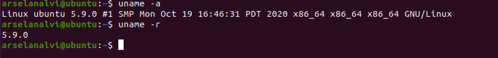
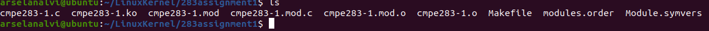
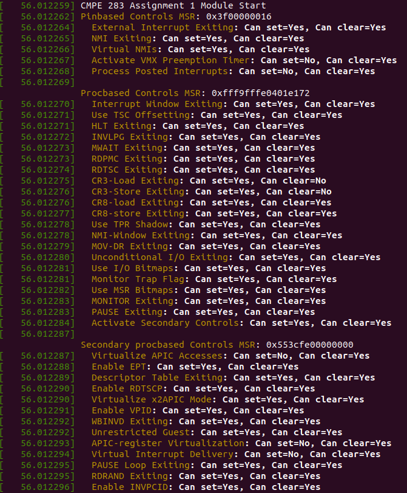
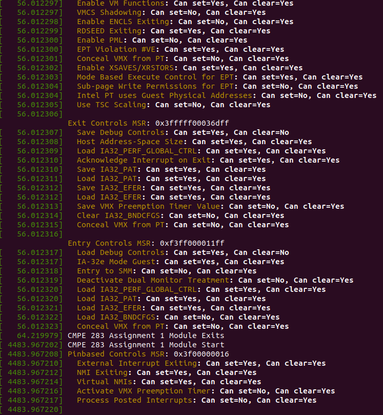
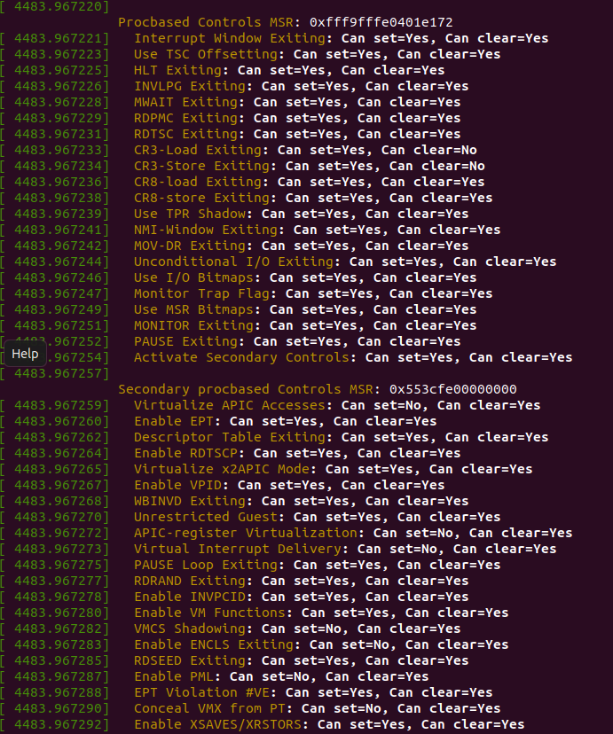
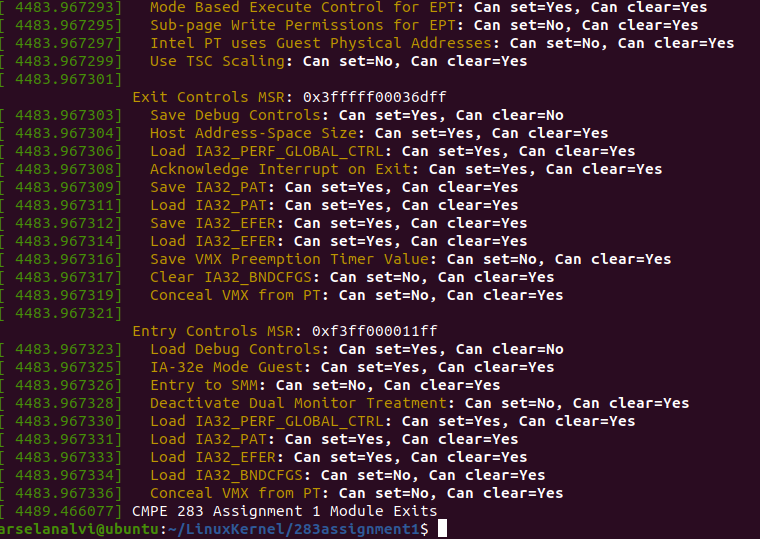

<h1>Assignment 1
CMPE 283
Discovering VMX Features</h1>

Question 1
Arselan (me)
Used VMWare fusion as a Virtual Machine 
Researched and built/compiled Linux Kernel source code and got the environment setup. 
Implemented 283-1.c file. 
Tested it by loading the new module and verified the output.
Rajakumari
Researched about VMX virtualization features and MSRs. 
Researched Intel 64 and IA-32 Architectures Software Developer’s Manual Vol:3C about various VMX configuration MSRs to the capabilities and features as listed in the assignment which were used in the 283-1.c file implementation. 
Worked on the 283-1.c file implementation. 
Question 2 : Implementation of the software
Configure a Linux Machine. 
Download VMWare Fusion or any VM of your choice. (or use parallels) 
Download Ubuntu 20.04
Create a new VM in VMWare Fusion by dragging the .iso file which will install Ubuntu OS in the VM.
Specs used: 
CPU processor cores: 2
Memory: 4 GB
Disk: 105 GB
Build Linux Kernel Source code
Download Linux Kernel Archive from kernel.org. 
Download the tarball file (5.9 used for this assignment)
Install following packages:
Run command ‘sudo apt install build-essential rsync gcc bc bison libssl-dev libncurses5-dev libelf-dev’
Update grub file 
Run command ‘sudo update-grub’
Get the Linux Kernel tarball file and untar it
Run command ‘wget https://cdn.kernel.org/pub/linux/kernel/v5.x/linux-5.9.tar.xz’
Create a new directory ‘LinuxKernel’ and untar the file
Run command ‘mkdir yourdirname’
Run command ‘tar xvf linux-* -C yourdirname/ --strip-components=1’
Configure the Kernel Compilation and Compile the Kernel
Copy the config file that came with the linux distribution. 
Run command ‘cp /boot/config-$(uname -r) ./.config’
Compile kernel by running this command in your directory.
Run command ‘make deb-pkg’
Kernel will compile. This process took 5.5 hrs for me. 
Make sure Kernel has compiled successfully. 

Create a new Linux Kernel module that will query various MSR’s to determine Virtualization features. 
Inside your LinuxKernel directory create a new directory
Run command ‘mkdir 283assignment1’
Go to the 283assignment1 directory and create a cmpe283-1.c file
Run command ‘mkdir cmpe283-1.c’
Add the required functionality. 
Download the file ‘cmpe283-1.c’ and ‘makefile’ from the github link provided and run command ‘make’ while you are in the 283assignment1 directory. 
This will create ‘cmpe283-1.ko’ which we will use to load new modules into Kernel.

Load the new module in the Kernel
Run command ‘sudo insmod ./cmpe283-1.ko’
It will call init_module() which will call detect_vmx_features();
To stop use command ‘sudo rmmod ./cmpe283-1.ko’
Call cleanup_module()
Run command ‘dmesg’ to see syslog. 

Output of the module

