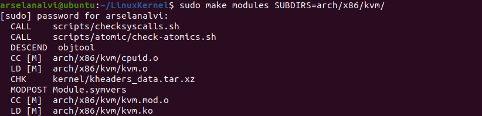
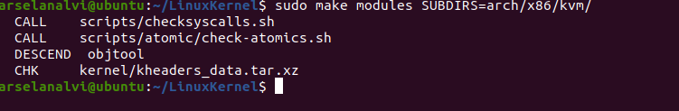
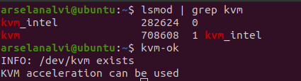
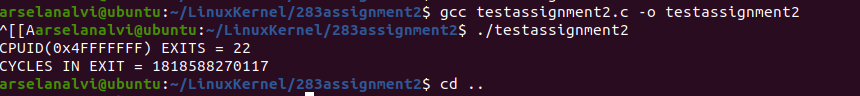

<h1>
Discovering VMX Features</h1> 
<h2>Question 1 :About Team </h2> 
 <h4>Arselan (me)</h4> 
 <ul>
 <li>Used VMWare fusion as a Virtual Machine </li> 
 <li>Researched and built/compiled Linux Kernel source code and got the environment setup. </li> 
  <li>Researched about MSRs in the Intel dev manual. </li> 
 <li>Implemented 283-1.c file.</li>  
 <li>Tested it by loading the new module and verified the output.</li></ul>  
<h4>Rajakumari</h4> 
<ul>
<li>Researched about VMX virtualization features and MSRs. </li> 
<li>Researched Intel 64 and IA-32 Architectures Software Developer’s Manual Vol:3C about various VMX configuration MSRs to the capabilities and features as listed in the assignment which were used in the 283-1.c file implementation. </li> 
 <li>Worked on the 283-1.c file implementation. </li> 
<li> Reference: https://www.intel.com/content/dam/www/public/us/en/documents/manuals/64-ia-32-architectures-software-developer-vol-3c-part-3-manual.pdf</li>
</ul> 
 
<h2>Question 2 : Implementation of the software</h2> 
<h4>Configure a Linux Machine.</h4>  
<ul>
<li>Download VMWare Fusion or any VM of your choice. (or use parallels)</li>  
 <li>Download Ubuntu 20.04</li> 
<li>Create a new VM in VMWare Fusion by dragging the .iso file which will install Ubuntu OS in the VM.</li> 
<li>Specs used: </li> 
 <ul>
<li>CPU processor cores: 2</li> 
<li>Memory: 4 GB</li> 
  <li>Disk: 105 GB</li></ul></ul> 
<h4>Build Linux Kernel Source code</h4> 
<ul>
<li>Download Linux Kernel Archive from kernel.org. </li> 
<li>Download the tarball file (5.9 used for this assignment)</li> 
<li>Install following packages:</li> 
<li>Run command ‘sudo apt install build-essential rsync gcc bc bison libssl-dev libncurses5-dev libelf-dev’</li> 
<li>Update grub file </li>  
<li>Run command ‘sudo update-grub’</li></ul> 
<h4>Get the Linux Kernel tarball file and untar it</h4> 
<ul>
<li>Run command ‘wget https://cdn.kernel.org/pub/linux/kernel/v5.x/linux-5.9.tar.xz’</li> 
<li>Create a new directory ‘LinuxKernel’ and untar the file</li> 
<li>Run command ‘mkdir yourdirname’</li> 
<li>Run command ‘tar xvf linux-* -C yourdirname/ --strip-components=1’</li></ul> 
 <h4>Configure the Kernel Compilation and Compile the Kernel</h4> 
 <ul>
<li>Copy the config file that came with the linux distribution. </li> 
<li>Run command ‘cp /boot/config-$(uname -r) ./.config’</li> 
<li>Compile kernel by running this command in your directory.</li> 
<li>Run command ‘make deb-pkg’</li> 
 <li>Kernel will compile. This process took 5.5 hrs for me.</li>  
 <li>Make sure Kernel has compiled successfully. </li></ul> 
 

 
<h4>Create a new Linux Kernel module that will query various MSR’s to determine Virtualization features.</h4>  
<ul>
<li>Inside your LinuxKernel directory create a new directory</li> 
<li>Run command ‘mkdir 283assignment1’</li> 
<li>Go to the 283assignment1 directory and create a cmpe283-1.c file</li> 
<li>Run command ‘mkdir cmpe283-1.c’</li> 
<li>Add the required functionality. </li> 
<li>Download the file ‘cmpe283-1.c’ and ‘makefile’ from the github link provided and run command ‘make’ while you are in the 283assignment1 directory.</li>  
<li>This will create ‘cmpe283-1.ko’ which we will use to load new modules into Kernel.</li></ul> 

 <h5><i>Note: Make sure you have enabled "pass through virtualization extensions" in your VM !</i></h5> 

 <h4>Load the new module in the Kernel</h4> 
 <ul>
<li>Run command ‘sudo insmod ./cmpe283-1.ko’</li> 
<li>It will call init_module() which will call detect_vmx_features();</li> 
<li>To stop use command ‘sudo rmmod ./cmpe283-1.ko’</li> 
<li>Call cleanup_module()</li></ul> 
Run command ‘dmesg’ to see syslog.  
Output of the module 

___________________________________________________________________________________________________________________________________________________________________

<h1>
Modifying Instruction Behavior in KVM</h1> 
<h2>Question 1 :About Team </h2> 
 <h4>Arselan (me)</h4> 
 <ul>
 <li>Used VMWare fusion as a Virtual Machine </li> 
 <li>Researched and built/compiled Linux Kernel source code and got the environment setup. </li> 
  <li>Researched about external Kernel packages required to modify and load the kvm modules in Kernel </li> 
 <li>Implemented vmx.c and cpuid.c as per the assignment requirements.</li>  
 <li>Tested it by creating a test.c file and and also by loading the new module and verified the output.</li></ul>  
<h4>Rajakumari</h4> 
<ul>
<li>Researched about the KVM files and which files are required to edit. </li> 
<li>Researched about CPUID emulation code to figure out the number of exits and time spent in the exits. </li> 
 <li>Worked on the cpuid.c and vmx.c file implementation. </li> 
</ul> 
 
<h2>Question 2 : Implementation of the software</h2> 

<h4>Build Linux Kernel Source code</h4> 
<ul>
<li>Download Linux Kernel Archive from kernel.org. </li> 
<li>Download the tarball file (5.9 used for this assignment)</li> 
<li>Run command ‘sudo apt install build-essential rsync gcc bc bison libssl-dev libncurses5-dev libelf-dev’</li> 
<li>Run command ‘sudo update-grub’</li></ul> 

<h4>Get the Linux Kernel tarball file and untar it</h4> 
<ul>
<li>Run command ‘wget https://cdn.kernel.org/pub/linux/kernel/v5.x/linux-5.9.tar.xz’</li></ul> 

 <h4>Configure the Kernel Compilation and Compile the Kernel</h4> 
 <ul>
<li>Copy the config file that came with the linux distribution. </li> 
<li>Run command ‘make deb-pkg’</li> 
 <li>Make sure Kernel has compiled successfully. Reboot</li></ul> 
 

 
<h4>Modify the KVM behavior</h4>  
<ul>
<li>Modify the files in linux/arch/x86/kvm/cpuid.c and linux/arch/x86/kvm/vmx/vmx.c files </li> 
<li>In vmx.c create an exit_counter and exit_delta_tsc. </li> 
<li>Edit vmx_handle_exit() by getting the time difference to calculate time taken for exit cycles and increment the exit counter to get the count of exits. </li> 
<li>In cpuid.c fetch exit_counter and exit_delta_tsc, imported from vmx.c </li> 
<li>Make changes in the kvm_emulate_cpuid() method by passing the exit_counter and exit_delta_tsc in the eax, ebx and ecx registers. </li> 
<li>Build the kvm and kvm-intel modules to test the new changes</li> 
<li>Run command 'sudo make modules SUBDIRS=arch/x86/kvm/'</li> 

<li>Run command ‘sudo rmmod kvm’</li> 
<li>Run command 'sudo rmmod kvm-intel'. </li> 
<li>Reboot and Run command 'sudo insmod kvm-intel' and 'sudo insmod kvm'. </li> 
<li>Make sure KVM is correctly loaded. </li> 

<li></li>  
<li>Create a testassignment2.c file to test the exits and cycles in exit.</li></ul> 
<li>Compile and Run. </li> 

 <h5><i>Note: Make sure you have enabled "pass through virtualization extensions" in your VM !</i></h5> 

