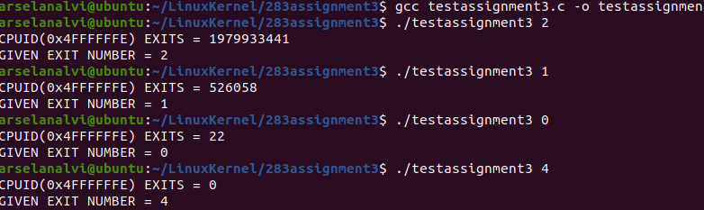

<h1>
Instrumentation via hypercall</h1> 
<h2>Question 1 :About Team </h2> 
 
 <h4>Arselan (me)</h4> 
 <ul>
 <li>Used VMWare fusion as a Virtual Machine </li> 
 <li>Researched and built/compiled Linux Kernel source code and got the environment setup. </li> 
  <li>Researched about external Kernel packages required to modify and load the kvm modules in Kernel </li> 
 <li>Implemented vmx.c and cpuid.c as per the assignment requirements.</li>  
 <li>Tested it by creating a test.c file and and also by loading the new module and verified the output.</li> 
 <li>Tested it by entering different exit numbers. The process will be explained below.</li>
 </ul>  

<h5>vmx.c</h5> 
 <ul>
 <li>In vmx.c modify the vmx_handle_exit()</li> 
 <li>Appendix C Intel SDM defines 65 Exit Reasons. Created an array of size 65.</li> 
  <li>vmx.h defines all the exit reasons which are handled by the linux kvm</li> 
 <li> https://github.com/arselan95/linux/blob/master/arch/x86/include/uapi/asm/vmx.h </li>  
 <li>But the exit reasons in vmx.h does not cover all the exit reasons defined in Intel SDM .</li>  
 <li>Set those (missed ones) to -1.</li> 
 <li>Create a loop and get the exit number and number of exits which will be used in cpuid.c.</li>
 </ul>  
 
 
 

<h5>cpuid.c</h5> 
 <ul>
 <li>In cpuid.c make changes to kvm_emulate_cpuid()</li> 
 <li>Create new CPUID %eax leaf 0x4FFFFFFE</li> 
  <li>Get the requested data</li> 
 </ul>  

<h4>Rajakumari</h4> 
<ul>
<li>Researched about the KVM files and which files are required to edit. </li> 
<li>Researched about CPUID emulation code to figure out the number of exits for a particular exit. </li> 
</ul> 
 

<h2>Question 2 : Implementation of the software</h2> 

<h4>Build Linux Kernel Source code</h4> 
<ul>
<li>Download Linux Kernel Archive from kernel.org. </li> 
<li>Download the tarball file (5.9 used for this assignment)</li> 
<li>Run command ‘sudo apt install build-essential rsync gcc bc bison libssl-dev libncurses5-dev libelf-dev’</li> 
<li>Run command ‘sudo update-grub’</li></ul> 

<h4>Get the Linux Kernel tarball file and untar it</h4> 
<ul>
<li>Run command ‘wget https://cdn.kernel.org/pub/linux/kernel/v5.x/linux-5.9.tar.xz’</li></ul> 

 <h4>Configure the Kernel Compilation and Compile the Kernel</h4> 
 <ul>
<li>Copy the config file that came with the linux distribution. </li> 
<li>Run command ‘make deb-pkg’</li> 
 <li>Make sure Kernel has compiled successfully. Reboot</li></ul> 
 

 
<h4>Modify the KVM behavior</h4>  
<ul>
<li>Modify the files in linux/arch/x86/kvm/cpuid.c and linux/arch/x86/kvm/vmx/vmx.c files </li> 
<li>In vmx.c create an exit_counter and exit_num (exit reason). </li> 
<li>Edit vmx_handle_exit() by getting the exit reason and number of exits for that reason . </li> 
<li>In cpuid.c fetch exit_counter and exit_num, imported from vmx.c </li> 
<li>Make changes in the kvm_emulate_cpuid() method by managing the exit_counter and exit_num in the eax and ecx registers. </li> 
<li>If a value not defined by the SDM, return 0 in all eax, ebx, ecx and 0xFFFFFFFF in edx. </li> 
<li>Build the kvm and kvm-intel modules to test the new changes</li> 
<li>Run command 'sudo make modules SUBDIRS=arch/x86/kvm/'</li> 

<li>Run command ‘sudo rmmod kvm’</li> 
<li>Run command 'sudo rmmod kvm-intel'. </li> 
<li>Reboot and Run command 'sudo insmod kvm-intel' and 'sudo insmod kvm'. </li> 
<li>Make sure KVM is correctly loaded. </li> 

<li>Create a testassignment3.c file to test the number of exits based on the requested exit number.</li> 
<li>Compile and Run.</li> 
</ul> 

 <h5><i>Note: Make sure you have enabled "pass through virtualization extensions" in your VM !</i></h5> 
 
 <h4>Question 3: About frequency of exits</h4> 
<ul>
<li>They do not increase at a stable rate. </li>
<li>More exits performed when I try to run other instructions such as I/O. </li>
 <li>Full VM boot entails approximately 22 exits. </li>
</ul> 

 <h4>Question 4: About frequency of exits</h4> 
<ul>
<li>Intel SDM defines 65 exit reasons. </li>
<li>Most frequent: I/O instruction and Triple fault. </li>
 <li>Least frequent: Exception or non maskable interrupt. </li>
 <li>Most of them were 0. Large amount of exits and less occurences. </li>
</ul> 
