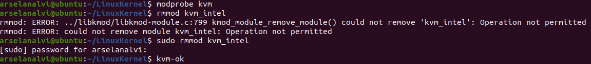
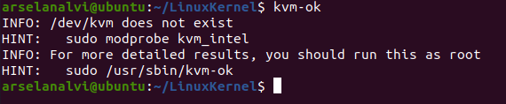
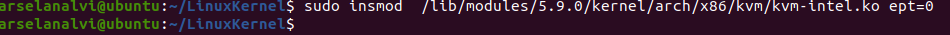
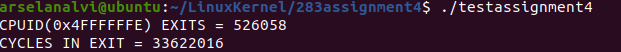
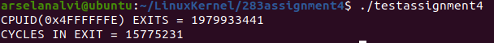

<h1>
Nested Paging Vs Shadow Paging</h1> 
<h2>Question 1 :About Team </h2> 
 
 <h4>Arselan (me)</h4> 
 <ul>
 <li>Used VMWare fusion as a Virtual Machine </li> 
 <li>Researched and built/compiled Linux Kernel source code and got the environment setup. </li> 
  <li>Researched about external Kernel packages required to modify and load the kvm modules in Kernel </li> 
 <li>Implemented vmx.c and cpuid.c as per the previous assignment requirements.</li>  
 <li>Tested requirements by creating a test.c file.</li> 
 <li>Tested it with both shadow and nested paging.</li>
 </ul>  
 

<h4>Rajakumari</h4> 
<ul>
<li>Researched about the KVM files and which files are required to edit. </li> 
<li>Researched about shadow and nested paging. </li> 
</ul> 
 

<h2>Question 1 : Implementation of the software / configuration</h2> 

<h4>Assignment 3 working condition</h4> 
<ul>
<li>https://github.com/arselan95/linux/tree/master/283assignment3</li></ul> 

 
<h4>Configure as per requirement</h4>  
<ul>
<li>CPUID node 0x4FFFFFFE created.</li> 
<li>Boot VM , run the code and get the total count of exits. </li> 
<li>Run command 'sudo rmmod kvm-intel'. </li> 

<li>Check if kvm is unloaded. </li> 

<li>Run command 'insmod  /lib/modules/XXX/kernel/arch/x86/kvm/kvm-intel.ko ept=0'. </li> 

<ul>
<li>'XXX' is Kernel Version used to build. </li> 
<li>parameter ept=0 enables shadow paging. </li> 
</ul> 
<li>Run the same code and check output. </li> 
<li>Create a testassignment4.c file to test the total exits and time taken.</li> 
<li>Compile and Run.</li> 
</ul> 

 <h5><i>Note: Make sure you have enabled "pass through virtualization extensions" in your VM !</i></h5> 
 
 <h2>Question 2: Sample print of Exit output 'with ept' and 'without ept'</h2> 

<h5> Without ept </h5>

<h5> With ept </h5>

 

 <h2>Question 3: Exit count</h2> 
<ul>
<li>Increase Exit count was expected with shadow paging. As VM will exit on each and every Page fault to update the tables.</li>
</ul> 

 <h2>Question 4: The Differences</h2> 
<ul>
<li>When shadow paging was turned on more exits happened. </li>
<li>Exit count increased remarkably. </li>
</ul> 
